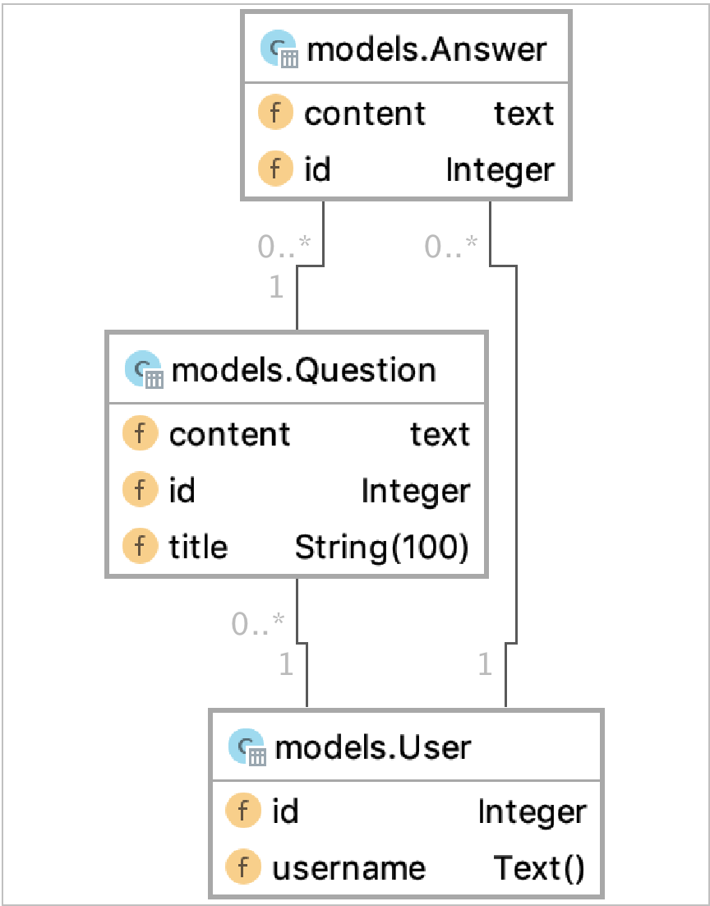

# SOEN487 Assignment 1

Using SQLAlchemy to design and create a database, create views to access and modify the data in the database, and create unit and functional tests to test the service
### Step 1: Design database

#### model dependency diagram:

### Step 2: Create the views

Each model has a view, views are Separated from main using Blueprint.

Each model has 'GET' method(get all and get by id), 'POST' for insert data, 'PUT' for edit data, 'DELETE' for delete data
### Step 3: Test the views

Unit test for each possible case of each view

test app: passed 2 of 2

test user view: passed 12 of 12

test question view: passed 13 of 13

test answer view: passed 15 of 15

